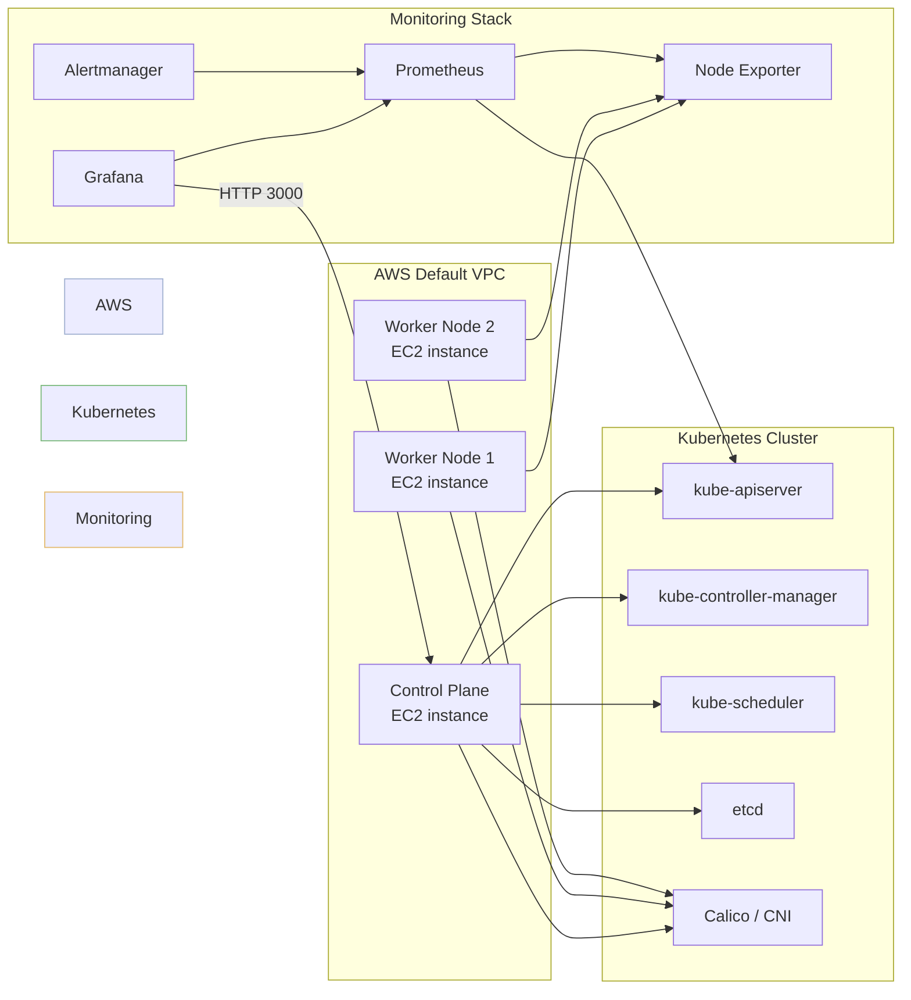

# Architecture

This project provisions a small Kubernetes cluster on AWS and installs the Prometheus monitoring stack.
The architecture is intentionally simple so it can be deployed quickly while still supporting observability and alerting.

## Components

- **Terraform `tf-k8s/`** provisions AWS infrastructure:
  - AWS default VPC and public subnets
  - one control-plane EC2 instance
  - configurable worker EC2 instances
  - security group rules for SSH, Kubernetes API, NodePort, Grafana, and Calico networking
- **Cluster bootstrap scripts** in `scripts/` install containerd, Kubernetes components, and initialize the cluster.
- **Monitoring** is deployed from `monitoring/` using the `kube-prometheus-stack` Helm chart.
- **Grafana** provides dashboards for node metrics and Kubernetes health.
- **PrometheusRule alerts** are configured in `monitoring/alerts/custom-alerts.yaml`.

## High-level topology

## Diagram asset

A visual diagram is available at `docs/screenshots/architecture-diagram.svg`.

## Notes

- The cluster uses the default VPC for simplicity; adjust the Terraform configuration if you need a custom VPC.
- Grafana runs on port `3000` by default when the monitoring stack is installed.
- Alerting can be extended by editing `monitoring/alerts/custom-alerts.yaml` and configuring receivers in `monitoring/values.yaml`.
