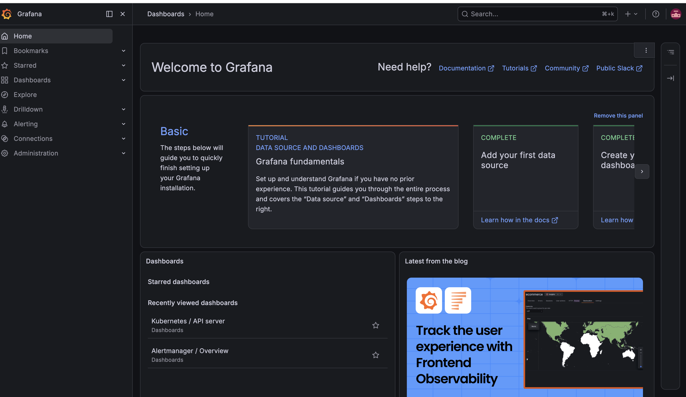
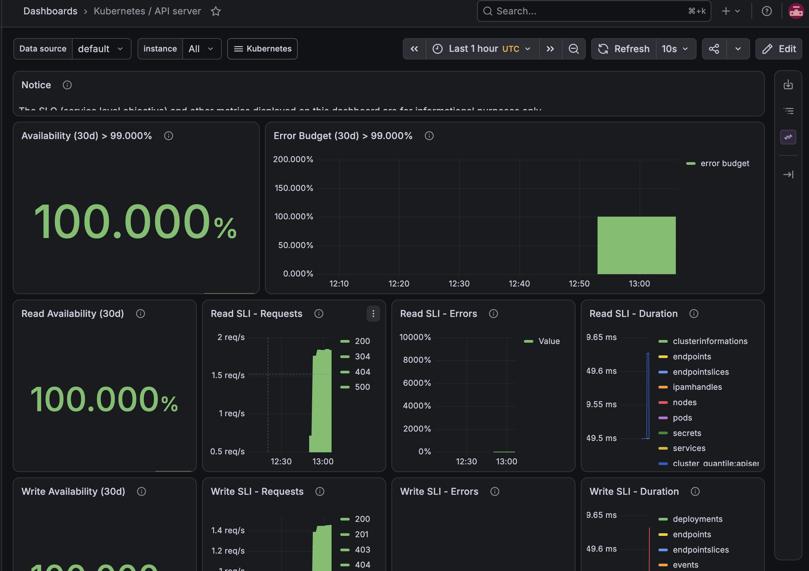

# Monitoring and Dashboards

This guide describes Grafana dashboard access, sample alert examples, and monitoring best practices for this repo.

## Grafana dashboard access

After installing the monitoring stack, Grafana is available on the control-plane node at:

```bash
http://<control-plane-ip>:3000
```

Default dashboards should include:

- Kubernetes cluster health
- Node exporter metrics
- Pod and container resource usage
- Alerts and notification status

## Example screenshots

The following images reflect the current cluster and monitoring setup and can be updated later with higher-quality exports:







## Recommended dashboard panels

- CPU utilization by node
- Memory usage and free memory
- Disk I/O and filesystem usage
- Kubernetes pod restarts and pod status
- Prometheus target health

## Alert examples

The monitoring stack includes custom Prometheus alert rules in `monitoring/alerts/custom-alerts.yaml`.

### Example alert: NodeExporterDown

```yaml
alert: NodeExporterDown
expr: up{job="node-exporter"} == 0
for: 5m
labels:
  severity: critical
annotations:
  summary: "Node exporter is down on {{ $labels.instance }}"
  description: "No data received from node exporter for more than 5 minutes."
```

Meaning:
- Prometheus is not receiving metrics from the node exporter on a host.
- Check the node exporter pod or service, and verify network connectivity.

### Example alert: HighNodeCPU

```yaml
alert: HighNodeCPU
expr: 100 - (avg by(instance)(irate(node_cpu_seconds_total{mode="idle"}[5m])) * 100) > 80
for: 5m
labels:
  severity: warning
annotations:
  summary: "High CPU usage on {{ $labels.instance }}"
  description: "CPU usage is above 80% for more than 5 minutes."
```

Meaning:
- A node is under sustained CPU pressure.
- Investigate container workloads, daemonsets, and resource requests/limits.

### Example alert: HighNodeMemory

```yaml
alert: HighNodeMemory
expr: (1 - (node_memory_MemAvailable_bytes / node_memory_MemTotal_bytes)) * 100 > 80
for: 5m
labels:
  severity: warning
annotations:
  summary: "High memory usage on {{ $labels.instance }}"
  description: "Memory usage is above 80% for more than 5 minutes."
```

Meaning:
- Memory usage is consistently above 80%.
- Review memory-intensive applications and consider scaling or resizing nodes.

## Configuring receivers

Update `monitoring/values.yaml` with notification receiver configuration and re-run `install-monitoring.sh` or `install-monitoring-remote.sh`.

Supported examples in the repository include:
- email / SMTP
- Slack
- PagerDuty

## Troubleshooting

- Use `kubectl -n monitoring get pods` to verify Prometheus, Grafana, and Alertmanager pods are running.
- Use `kubectl -n monitoring logs deploy/prometheus` to review ingestion or rule evaluation errors.

## Best practices

- Keep metrics retention and scrape intervals aligned with your cluster size.
- Avoid over-alerting by tuning threshold values and `for` durations.
- Store dashboard exports in source control so they can be re-imported when the stack is recreated.
